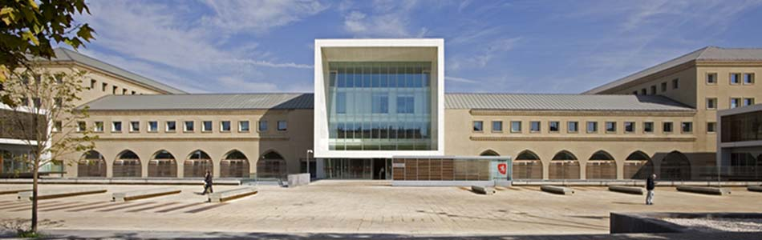
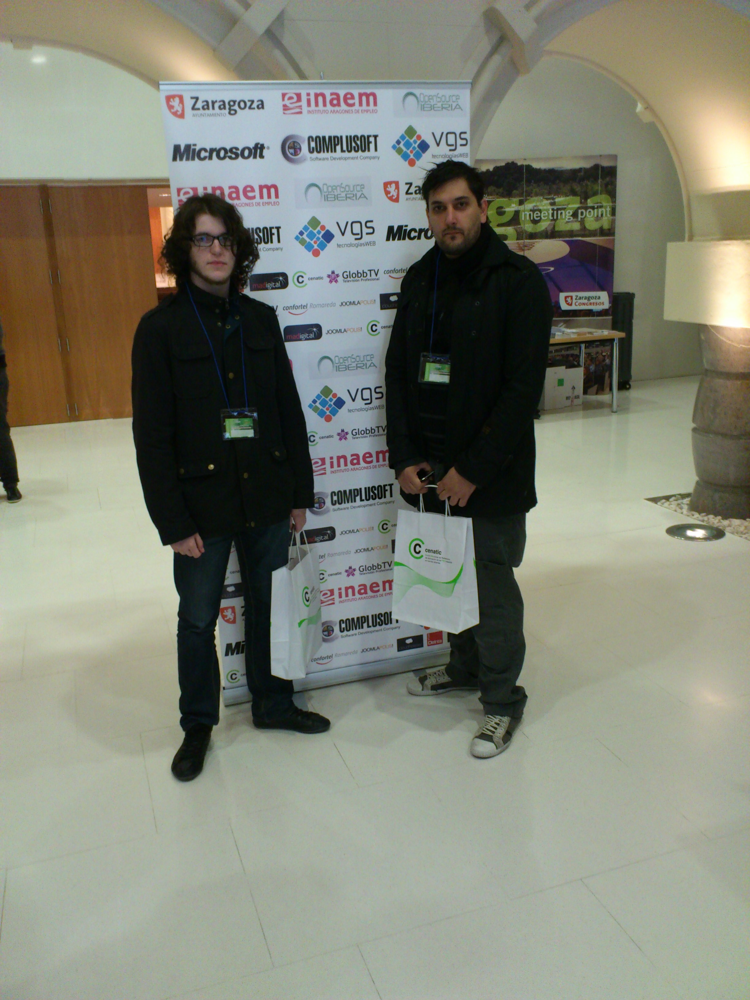
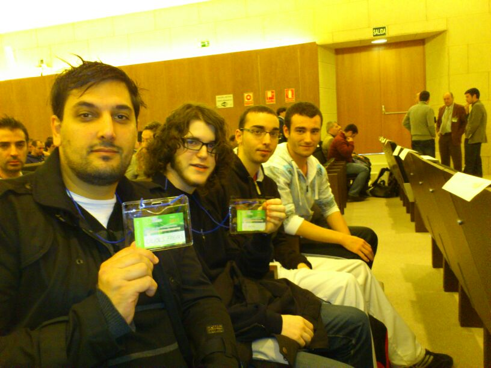

===================================
Libre Software World Conference
===================================

:Fecha: 9 y 10 de Noviembre
:Autor: Alberto González

Índice
=======

- Información_
- Ponencias_
- Valoración_

.. raw:: pdf

  PageBreak

.. _Información:

Información
===============

		 
El Ayuntamiento de Zaragoza, como prueba de su apuesta continuada por el software libre, organiza la **LSWC11** junto al Cluster Pro-entidades del Software Libre de Aragón (CESLA) y la Federación Nacional de Empresas de Software Libre (ASOLIF).

Las Jornadas se celebrarán en el edificio Seminario del Ayuntamiento de Zaragoza.

La **LSWC11** se configura como un gran evento de eventos, en el que se desarrollarán más de 80 talleres y ponencias, de ponentes nacionales e internacionales, integrados en tres eventos principales:

- La propia **LSWC11**, cuyos contenidos están enfocados a diferentes temas relacionados con software libre (novedades empresariales, migraciones, nuevas herramientas de gestión, aspectos relacionados con programación, otras)

- El **Joomla! Day Spain ZGZ 2011**, encuentro nacional anual por excelencia de la Comunidad de Joomla!, 4ª edición en España de una línea mundial de congresos sobre Joomla!, el muy popular gestor de contenidos en código abierto. Está organizado por la Asociación Open Source Iberia

- El **DiaPythonZGZ**, sobre el lenguaje de programación en código abierto Python, empleado en la creación de aplicaciones web, con ponencias impartidas por los organizadores, los miembros de Python-hispano. Al evento acuden tanto empresas, asociaciones o profesores de universidad a impartir sus charlas. Tanto unas ponencias como otras representan una oportunidad ideal para intercambiar conocimientos entre programadores y usuarios.

Los numerosos casos de buenas prácticas expuestos suponen un foco de promoción de ambas plataformas entre empresas, administraciones públicas y usuarios de software libre que acuden al evento. Como colofón a la **LSWC11**, y tras la celebración de la misma, se celebrará los días 11 y 12, en el Centro de Incubación Empresarial Milla Digital (CIEM) de Zaragoza, el Zentyal Summit, evento sobre servidores de Linux para PYMEs, co-organizado por la firma Zentyal y el Ayuntamiento de Zaragoza.

La inscripción a todos los eventos de la Libre Software World Conference 2011 es gratuita a excepción del programa de contenidos incluido en el Joomla! Day

.. raw:: pdf

  PageBreak
  
  
.. _Ponencias:

Ponencias
============

Hay multitud de charlas y talleres sobre Software Libre y las herramientas que cada vez tienen más peso en el mercado de software.
En concreto estuve en:

- Introducción a Node.js
- Desarrollo web con express.js (node.js + MVC)
- Taller de Venta de Software Libre
- Merengue: CMS basado en Django.
- Screen Scraping: aumentado el poder de la web

-----------------------------------------------------------------------------------------
Introducción a Node.js
-----------------------------------------------------------------------------------------

Node.js se define como "Evented I/O for V8 JavaScript".
Es una librería de I/O (input/output, entrada/salida). Enfocada sobre todo a la creación de servidores (http u otros).
Está basada en eventos. Esto significa que el API es no-bloqueante, por tanto es asíncrona.
Es un framework JavaScript desarrollado con el intérprete JavaScript de Google: V8.

- Es asombrosamente rápido. Soporta fácilmente muchas miles de conexiones simultáneas, y varias miles de peticiones por segundo. Y sin apenas usar recursos del sistema.
- Es fácil de empezar a usar: se programa en javascript.
- Ideal para la web: programamos en el mismo lenguaje en el cliente y en el servidor. Soporta nativamente JSON (ideal para APIs REST).
- Soporta de manera muy natural comet / websockets. Ya que todo es asíncrono y no existe penalización porque una petición quede abierta mucho tiempo. En este taller aprenderemos los fundamentos de nodejs, por qué es tan potente, y por qué va a dar mucho de qué hablar. Se harán diversos ejemplos de servidores web. 

Es una herramienta muy interesante.

-----------------------------------------------------------------------------------------
Desarrollo web con express.js (node.js + MVC)
-----------------------------------------------------------------------------------------

Express.js es un framework de desarrollo web MVC que corre sobre node.js. Está diseñado para ser sencillo, extensible y absurdamente rápido.
Funciona a modo de modelo-vista-controlador sobre Node.js.

.. raw:: pdf

  PageBreak

-----------------------------------------------------------------------------------------
Taller de Venta de Software Libre
-----------------------------------------------------------------------------------------

Un taller dedicado a analizar las trabas que nos encontramos a la hora de vender los productos de nuestras empresas: clientes críticos, competidores maliciosos, producto mal definido, ofertas irresistibles...
El objetivo es compartir experiencias y sugerir soluciones que nos ayuden a ser más competitivos también en las ventas.

-----------------------------------------------------------------------------------------
Merengue: CMS basado en Django.
-----------------------------------------------------------------------------------------

Django es una excelente plataforma para el desarrollo web, con una extensa comunidad de desarrolladores. Posiblemente sea a día de hoy el framework Python de desarrollo web más popular. Sin embargo, los productos CMS existentes en Django no tienen la funcionalidad tan completa como otras soluciones existentes (Drupal, Plone, Alfresco, ModX, etc.).

El proyecto Merengue intenta rellenar ese hueco. Es financiado por la Universidad de Málaga y toma ventaja del conocimiento de sus desarrolladores en otros CMS sacando las mejores ideas e implementando una nueva herramienta para gestión de contenidos web.

-----------------------------------------------------------------------------------------
Screen Scraping: aumentado el poder de la web
-----------------------------------------------------------------------------------------

El Screen Scraping es una forma de conseguir determinada información de cualquier documento a través de programación.
El objetivo en esta charla es mostrar como con Python + Amara se puede conseguir filtrar información de una página Web y extrapolarla a un documento o cualquier otra forma de representación de la información.

.. raw:: pdf

  PageBreak
  
  
.. _Valoración:

Valoración
=================

El evento ha estado muy bien, se ha llenado de muchas personas cada cual más interesante de conocer y las ponencias han sido muy enriquecedoras.
Personalmente la que más me ha gustado ha sido la de Node.js, proyecto que conocía que existía pero que no lo había llegado a usar.

Como no todo es perfecto, aún se le pueden poner pegas al evento y es que la falta de tiempo en algunas charlas ha echo que sean demasiado rápidas y no de tiempo a mostrar todo.

Si para el año que viene se mejora este aspecto del tiempo y se le da a cada charla un poco más de tiempo será mejor tanto para asistentes como para ponentes.

