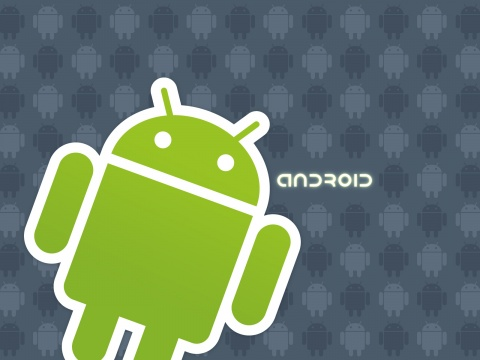
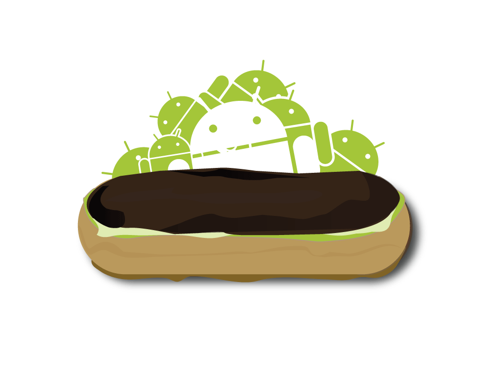
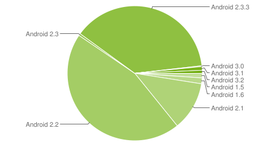
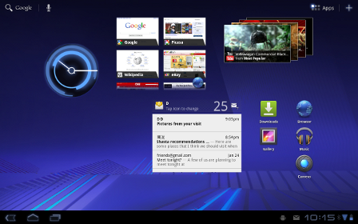

============================
Android: El OS del futuro
============================

.. image:: 2.png 
    	 :align: center 

:Autor: Alberto González y Sorin Vleju
:Fecha: 17-10-2011

Índice
======

- Introducción_
- Android1_
- Android2_
- Futuro_

.. raw:: pdf

  PageBreak

.. _Introducción:

Introducción
============
		 
**Informacion general Android**

Android es un sistema operativo basado en el núcleo Linux diseñado originalmente para dispositivos móviles, tales como teléfonos inteligentes, pero que posteriormente se expandió su desarrollo para soportar otros dispositivos tales como tablets, reproductores MP3, netbooks, PCs, televisores, lectores de e-books e incluso, se han llegado a ver en el CES, microondas y lavadoras.9
Fue desarrollado inicialmente por Android Inc., una firma comprada por Google en 2005.10 Es el principal producto de la Open Handset Alliance, un conglomerado de fabricantes y desarrolladores de hardware, software y operadores de servicio.11 Las unidades vendidas de teléfonos inteligentes con Android se ubican en el primer puesto en los Estados Unidos, en el segundo y tercer trimestres de 2010,12 13 14 con una cuota de mercado de 43,6% en el tercer trimestre.15
Android tiene una gran comunidad de desarrolladores escribiendo aplicaciones para extender la funcionalidad de los dispositivos. A la fecha, se han sobrepasado las 250.000 aplicaciones disponibles para la tienda de aplicaciones oficial de Android: Android Market, sin tener en cuenta aplicaciones de otras tiendas no oficiales para Android, como pueden ser la App Store de Amazon o la tienda de aplicaciones de Samsung.16 17 Android Market es la tienda de aplicaciones en línea administrada por Google, aunque existe la posibilidad de obtener software externamente. Los programas están escritos en el lenguaje de programación Java.18 No obstante, no es un sistema operativo libre de malware, aunque la mayoría de ello es descargado de sitios de terceros.19
El anuncio del sistema Android se realizó el 5 de noviembre de 2007 junto con la creación de la Open Handset Alliance, un consorcio de 78 compañías de hardware, software y telecomunicaciones dedicadas al desarrollo de estándares abiertos para dispositivos móviles.20 21 Google liberó la mayoría del código de Android bajo la licencia Apache, una licencia libre y de código abierto.22 Actualmente Android posee aproximadamente el 32,9% de cuota de mercado a escala mundial de los teléfonos inteligentes, por delante de Symbian OS que posee una cuota aproximada del 30,6%. En tercer lugar se sitúa iOS con una cuota de mercado del 16%.
La estructura del sistema operativo Android se compone de aplicaciones que se ejecutan en un framework Java de aplicaciones orientadas a objetos sobre el núcleo de las bibliotecas de Java en una máquina virtual Dalvik con compilación en tiempo de ejecución. Las bibliotecas escritas en lenguaje C incluyen un administrador de interfaz gráfica (surface manager), un framework OpenCore, una base de datos relacional SQLite, una API gráfica OpenGL ES 2.0 3D, un motor de renderizado WebKit, un motor gráfico SGL, SSL y una biblioteca estándar de C Bionic. El sistema operativo está compuesto por 12 millones de líneas de código, incluyendo 3 millones de líneas de XML, 2,8 millones de líneas de lenguaje C, 2,1 millones de líneas de Java y 1,75 millones de líneas de C++.

		 
**Adquisición por parte de Google**

En julio de 2005, Google adquirió Android Inc., una pequeña compañía de Palo Alto, California fundada en 2003.23 Entre los cofundadores de Android que se fueron a trabajar a Google están Andy Rubin (co-fundador de Danger),24 Rich Miner (co-fundador de Wildfire Communications, Inc.),25 Nick Sears (alguna vez VP en T-Mobile),26 y Chris White (quien encabezó el diseño y el desarrollo de la interfaz en WebTV).27 En ese entonces, poco se sabía de las funciones de Android Inc. fuera de que desarrollaban software para teléfonos móviles.23 Esto dio pie a rumores de que Google estaba planeando entrar en el mercado de los teléfonos móviles.
En Google, el equipo liderado por Rubin desarrolló una plataforma para dispositivos móviles basada en el kernel de Linux que fue promocionado a fabricantes de dispositivos y operadores con la promesa de proveer un sistema flexible y actualizable. Se informó que Google había alineado ya una serie de fabricantes de hardware y software y señaló a los operadores que estaba abierto a diversos grados de cooperación por su parte.28 29 30
La especulación sobre que el sistema Android de Google entraría en el mercado de la telefonía móvil se incrementó en diciembre de 2006.31 Reportes de BBC y The Wall Street Journal señalaron que Google quería sus servicios de búsqueda y aplicaciones en teléfonos móviles y estaba muy empeñado en ello. Medios impresos y en línea pronto reportaron que Google estaba desarrollando un teléfono con su marca.32
En septiembre de 2007, «InformationWeek» difundió un estudio de Evalueserve que reportaba que Google había solicitado diversas patentes en el área de la telefonía móvil.33 34
[editar]Open Handset Alliance
El 5 de noviembre de 2007 la Open Handset Alliance, un consorcio de varias compañías entre las que están Texas Instruments, Broadcom Corporation, Nvidia, Qualcomm, Samsung Electronics, Sprint Nextel, Intel, LG, Marvell Technology Group, Motorola, y T-Mobile; se estrenó con el fin de desarrollar estándares abiertos para dispositivos móviles.11 Junto con la formación de la Open Handset Alliance, la OHA estrenó su primer producto, Android, un plataforma para dispositivos móviles construidas en la versión 2.6 del kernel de Linux.
El 9 de diciembre de 2008, se anunció que 14 nuevos miembros se unirían al proyecto Android, incluyendo PacketVideo, ARM Holdings, Atheros Communications, Asustek, Garmin, Softbank, Sony Ericsson, Toshiba, Vodafone y ZTE.35 36
[editar]Historial de actualizaciones
Android ha visto numerosas actualizaciones desde su liberación inicial. Estas actualizaciones al sistema operativo base típicamente arreglan bugs y agregan nuevas funciones. Generalmente cada actualización del sistema operativo Android es desarrollada bajo un nombre en código de un elemento relacionado con postres.
Android ha sido criticado muchas veces por la fragmentación que sufren sus terminales al no ser soportado con actualizaciones constantes por los distintos fabricantes. Sin embargo, esa situación cambiará con un anuncio que hizo oficial Google en el que comunicó que los fabricantes se comprometerán a aplicar actualizaciones al menos 18 meses desde su salida al mercado37
Los nombres en código están en orden alfabético.

.. raw:: pdf

  PageBreak
  
  
.. _Android1:

Android1
========

El sistema operativo más usado en smartphones actualmente en el mundo no es una idea que se le ocurrió a alguien un día y tuvo un camino fácil para empezar a funcionar, sino que surge poco a poco y vive diferentes etapas hasta que el primer Android ve la luz. Hoy nos vamos a centrar en esa etapa de la historia de Android. Sus comienzos. La cuna de lo que hoy conocemos como un Android adolescente, al que aún le queda por madurar mucho, pero del que ya vemos y disfrutamos sus mejores cualidades.

Si queremos hablar de prehistoria de Android no nos queda más remedio que hablar un hombre. Ese hombre es Andy Rubin. Nos tenemos que remontar a 1986, cuando Andy recibió su licenciatura en Ciencias de la Computación en la Universidad de Utica, Nueva York. Podemos considerar que aquí empieza a gestarse todo lo que luego sería Android en su cabeza, pero apuesto a que una persona así todo esto le va madurando a lo largo de mucho tiempo. Tras ello empieza una aventura de una empresa a otra, como es común en EEUU.

Curiosamente su primer trabajo importante como ingeniero es en Apple, desde donde pasó a una empresa que surgió de Apple llamada General Magic, y aquí empezó con lo importante, ya que participó en el desarrollo de Magic Cup, lo que pretendía ser un sistema operativo para teléfonos o PDAs. Sin embargo General Magic fracasó y se fue a la ruina, momento en el cual Andy se unió a Artemis Research, que acabó comprada por Microsoft. Ya hemos tenido a Andy Rubin trabajando para Apple y Microsoft, curioso.

El caso es que tras unos años trabajando aquí se ve que empezó a querer hacer algo por su cuenta, y fundó Danger Inc., que finalmente sería también comprada por Microsoft. En Danger Inc. suceden cosas cosas muy importantes. La primera es que desarrollan el Hiptop, lo que es ya un teléfono que marcaría las primeras líneas de lo que serían los Smartphones, y la segunda es que se ve tan frustrado que decide abandonar la compañía de la que era CEO. Todo ello le llevo a su paso final en esta etapa, fundar en 2003 Android Inc.

Andy Rubin llevaba desde 1989 hasta 2003 trabajando como ingeniero en telecomunicaciones y en el mundo de los teléfonos móviles. Su cabeza era un hervidero, y de ahí salió Android Inc., su proyecto para crear algo nuevo y diferente, aunque no creo que tuviera en mente lo que hoy es Android, pero sin duda dio todos los pasos correctos, y luchó mucho pasando por decepciones y fracasos.

En Agosto de 2005, cuando Android Inc. contaba con 22 meses de vida, Google adquirió la empresa, pero esta vez se ve que Andy estaba contento con esta venta, no como ocurrió con Danger Inc. De hecho Andy pasa a formar parte del equipo de Google, y es donde acaba como todos sabemos como vicepresidente de ingeniería de Google supervisando el desarrollo de Android.

Android ya tenía toda una base para empezar a trabajar y formarse. Un proceso que había durado nada más y nada menos que 16 años había construido una sólida base sobre la que todo iba a empezar a funcionar.

		 
A partir de aquí comienza el típico secretismo al que Google nos tiene acostumbrados, en el que todos rumoreaban acerca de qué estaba haciendo Google con una compañía de desarrollo de sistemas para teléfonos móviles. Hay un montón de artículos super curiosos, especialmente de Agosto de 2005, en los que se especula sobre muchísimas cosas, y vemos algunas realmente curiosas. Lo que estaba pasando lo sabemos ahora, estaban gestando y planeando lo que pretendían llevar a ser el futuro de la telefonía móvil, lo que querían convertir en el sistema operativo número uno de smartphone del mundo.

No fue hasta el 5 de Noviembre de 2007 que se hizo el anuncio oficial de Android, y a partir de ahí es lo que cuento en el artículo que antes os comenté. Pero durante estos dos años Google había estado haciendo cosas, moviéndose, y una de ella fue llegar a acuerdos con fabricantes de teléfonos móviles para desarrollar el primer dispositivo Android de la historia. Todos sabemos que HTC siempre ha sido relacionado con Android desde los comienzos, no sólo fue el HTC quién fabricó el primer Nexus o Google Phone, sino que el primer Android también fue HTC, el Dream que fué lanzado el 22 de octubre de 2008.

Siempre habíamos pensado que era HTC el primero en fabricar un teléfono Android, pero ahora salen nuevas historias muy curiosas contando que no fue así, sino que fue LG. Aparentemente LG tenía listo un prototipo de teléfono para montar Android, pero las cosas no debieron ir muy bien, y fue finalmente HTC quién se llevo el gato al agua. No están muy claras las razones por las que esto ocurrió, pero que LG se quisiera centrar en su propio sistema con el Prada puede ser perfectamente la explicación.

Antes de que Google comenzara su andadura con Android en los dispositivos móviles comenzó a ofrecer servicios para estos dispositivos, fue durante 2006 y 2007 que lanzó Google Maps Mobile, Gmail Mobile, Google Search o Google SMS, para los sistemas Java ME, Symbian o Blackberry... Durante estos primeros momentos Google se percató del problema que existía a la hora de utilizar la plataforma más utilizada en ese momento, Java ME, no era otro que la lentitud en la creación de nuevas librerías destinadas a la utilización de los nuevos recursos que empezaban a proporcionar los equipos de nueva fabricación, aparte de un problema más que palpable en cuanto a rendimiento.

Es por ello que a lo largo de 2007 comienza a difundirse el rumor de que Google estaba en proceso de desarrollo de su propio Smartphone, en los mentideros, foros y en los entornos más Geeks de aquel año se empezó a hablar del "Gphone" como nombre del aparato tras el que se encontraban trabajando en su desarrollo, ni que decir tiene que aparecieron numerosas imagenes y vídeos totalmente falsos a este respecto y comentarios de lo más subrealistas como la afirmación de que el terminal sería gratuito puesto que se pagaría con la publicidad... Por ahí iban los tiros, pero no acertaron en la verdadera jugada maestra de los chicos de Mountain View, no era (en un primer momento) un terminal lo que escondían, 
sino un Sistema Operativo destinado a equipos móviles, por lo que no se trataría de crear un Gphone (como Gmail o Gmaps) como némesis del por entonces todo poderoso IPhone, sino de que varios terminales resultaran ser Gphones (Google Phones) gracias a la utilización de este Sistema Operativo en ellos.

En Noviembre de 2007 se anuncia la creación de la Open Handset Alliance, abanderada por Google y compuesto por un grupo de unas 30 compañías dedicadas en mayor o menor medida y en direferentes ámbitos del sector (sotfware, servicios, hardware, etc...) a la venta y consumo de recursos de dispositivos móviles y que Android es su apuesta como Sistema Operativo para uso genérico. Android comenzó sus pasos como el fruto del trabajo realizado por un grupo de desarrollo de software para dispositivos móviles fundado, entre otros, por Andy Rubin, actual director de la division de plataformas móviles de Google, este equipo de desarrollo se llamaba Android Inc, que fue comprada por Google en 2005. Durante esta presentación se comentan como virtudes más destacadas de este, por aquellos momentos, desconocido Sistema Operativo su condición de ser totalmente abierto y gratuito para que cualquier fabricante interesado en su utilización lo pueda usar en sus terminales, gracias, entre otras cosas a la utilización de un kernel basado en el kernel Linux, aparte de estos interesantes datos para atraer a las compañías fabricantes de hardware también hizo volcar las miradas de los desarrolladores de software hacia ellos con el anuncio casi simultáneo de la salida del compilador o kit de desarrollo y emulador de Android destinado a la creación de Aplicaciones para dispositivos con su SO.

**Versiones**

Los primeros pasos en el desarrollo de la plataforma no se dieron con terminales a la venta sino que se vieron en los lanzamientos de nuevas realeases del kit de desarollo o más conocido como Android SDK, después de facilitar la primera versión del SDK en Noviembre de 2007 tuvieron que pasar 11 meses, hasta mediados del verano de 2008 para ver la primera actualización, la 0.9, cuando hubo pasado un mes más nació la 1.0, la posterior actualización fue esencial, en Febrero de 2009 llegó la versión 1.1, todas estas actualizaciones en las Releases del Kit de desarrollo culminaron con una optimización de la plataforma que generó mejoras en todos los apartados básicos del "terminal virtual" ya que hasta ese momento no existía un equipo físico que lo cargara.
Después de muchas demostraciones, de haberse desarrollado algunas aplicaciones y de ver "proyectos" por aquí y por allá el mundo ve nacer el primer terminal en funcionamiento con el Sistema Operativo Android, el HTC G1 (o HTC Dream depende del lugar donde se haya comercializado), a los pocos meses, en Abril de ese mismo 2009 llegó la primera actualización, Android 1.5 (Cupcake), donde realmente se empiezan a ver mejoras considerables en el entorno general, el consumo de batería se reduce considerablemente, los widgets, visionado de vídeos de youtube y demás mejoras.
En un primer momento no se ve una comercialización de terminales con Android a gran escala, si bien es cierto que HTC si que se vuelca con los Androides y lanza varios equipos, a lo que le sigue Motorola también con un buen número y otras compañias comienzan a sacar Smartphones cargando el Sistema Operativo facilitado por Google, aquí comenzamos a ver un fenómeno no poco comentado entre los usuarios, todos usan Android, pero hay sutiles diferencias entre lo que vemos en una compañía y otra, esto es debido a las personalizaciones que cada compañía hace, HTC usa Sense, Motorola lo propio con Motoblur, Samsung implementa TouchWiz... Todo se maneja igual, pero luce diferente... si a esto le sumamos el "contenido" que aportan las operadoras, nos damos cuenta de que empieza (y todavía está en pañales) lo que posteriormente se denominó como la fragmentación, más acusada posteriormente con la aparición de nuevas versiones y la actualización aleatoria de terminales por parte de las Operadoras/Compañías sin mucho sentido.
Es importante citar que al poco tiempo vimos salir una nueva versión, esta vez llegó "Donut" (Android 1.6) sumando un nuevo postre a las dulces recetas de Google, llegando a ser sumamente beneficiosa en varios aspectos ya que resultó extremadamente buena y estable (como todas, el caso es que aquí las mejoras en las busquedas y la calidad de imagen fueron determinantes).

.. raw:: pdf

  PageBreak
  
  
.. _Android2:

Android2
========

Un antes y un después, llega Google Nexus One
Hay que citar que justo antes de la salida del N1 se lanzó la versión 2.0 de Android, denominada "Eclair" vista por primera vez en los Motorola Milestone/Droid, esta nueva versión requería de muchos más recursos que las anteriores, así que el salto de nivel tecnológico que estaba por llegar quedaba copado por esta versión que permitá un uso optimizado del 3D, fondos de pantalla animados, amplió el nivel de resolución de pantalla... Realmente se vio un gran salto de calidad. Al poco apareció una actualización que trataba de enmendar insignificantes errores de la versión anterior, 2.01.

A lo que vamos, Google satisfizo a su legión de incondicionles lanzando su propio terminal, el Nexus One fue fabricado por HTC (fabuloso premio para la marca por su fidelidad al Androide verde), un terminal que no dejó a nadie indiferente, con personalidad propia, resultaba y resulta hoy día atractivo a la vista, con una características técnicas envidibles era lo que se denomina comunmente en España un "pepino" de los buenos. En un principio fue comercializado en exclusiva por Google proporcionándolos mediante compra on-line (aunque no tuvieron el exito esperado con esta iniciativa por lo que posteriormente lo distribuyeron conjunto con operadoras, aunque siempre como terminal libre, aunque estuviera sujeto a contratos de permanencia y demás). Llegó con una actualización más, la 2.1, dentro de la familia de "Eclair" ya que en esta ocasión no se quiso tomar esta actualización como una nueva versión como pasó con "Donut" y "Cupcake" (recordad, el paso fue de 1.5 a 1.6) aunque las diferencias entre ambas eran evidentes gracias a las mejoras, una vez más implementadas en esta versión.

La gran expansión nn Mayo de 2010 fue anunciada la liberación de "Froyo", Android 2.2, un salto de calidad que no dejó indiferente a casi nadie, sobre todo por la posibilidad de usar Adobe flash player en la navegación web, aquí si se vio que la cosa pintaba muy bien, diferentes aspectos fueron llevados a otra dimensión, optimización casi total del Wi-Fi, Bluetooth, marcación por voz, menor consumo de la batería... Todo esto acompañado por una ampliación de la familia de terminales Android como no se había visto hasta la fecha, HTC Desire, Samsung Galaxy S puede que sean los avanderados junto con el Nexus One de este momento histórico al que acompañaron muchos más terminales en una gran variedad de gamas, precios y fabricantes, ya se empieza a ver al Androide en las tiendas de telefonía de una manera cotidiana, por contar una anécdota, en la primavera de 2010 estuve a punto de adquirir un terminal Android en una tienda especializada en varias operadoras, recuerdo que cuando pregunté a la dependienta sobre terminales Android, apenas sabía de lo que le hablaba, tenía que ir buscando por el catálogo uno a uno por que no sabía cuales cargaban el "Droid OS", cuando adquirí mi Samsung Galaxy S en las navidades de ese mismo año, volví al comercio antes mencionado y no solo sabía de lo que le hablaba, tenía estudiado al dedillo cada terminal, con todas sus carácterísticas y sin tener que mirar nada de nada.

A finales de 2010, el 6 de diciembre para ser más exactos, se liberó la última versión vista hasta la fecha para Smartphones, Gingerbread, la 2.3, se esperaba con ansias y ganas esta nueva actualización, al final no ha sido para tanto, si bien es verdad que trae muchas novedades, el asunto es que los usuarios de equipos Androides estamos muy mal acostumbrados a mucho y muy bueno, se esparaba algo radical y ha resultado ser una mejora algo más relativa, de todos modos lo visto es algo a considerar: Soporte nativo para VoIP SIP, soporte para la tecnología NFC, teclado rediseñado, posibilidad de cortar, pegar y copiar texto en el sistema... y muchas más. Hay que puntualizar que aún a fecha de creación de esta entrada son pocos los terminales que han disfrutado de una actualización a esta versión aunque se ha anunciado por parte de diversos fabricantes que el "Pan de Gengibre" estará de modo oficial en sus terminales; no obstante los cocineros, como siempre, han estado al quite y existen numerosas cROMs para diversos equipos que posibilitan disfrutar de 2.3 (y posteriores pequeñas actualizaciones 2.3.1, 2.3.2, 2.3.3 y 2.3.4), de este efecto el que más se puede resaltar es la liberación por por parte de Cyanogen MOD de su CM7 con Gingerbread para diversos Smartphones.

La consolidación en este año en el que estamos inmersos es donde Android se ha movido como pez en el agua, el punto donde se vieron culminadas las espectativas de Google en el mercado de la telefonía móvil, ser dominador del entorno sin ser fabricantes de equipos, dando un giro radical a lo visto hasta la fecha, ya importa menos quien fabrica el equipo, ahora preguntamos si el terminal tiene Android. Symbian, iOS... Todo esto se vio en el World Mobile Congress 2011 celebrado en la Fira de Barcelona, donde se lanzaron, anunciaron y presentaron muchos y variados terminales, aquí se vio la potencia que van a tener los nuevos equipos, el Chip Tegra 2 hizo furor con su doble nucleo, anuncio del Google Nexus S (fabricado por Samsung), el resurgir de HTC con una nueva hornada más que interesante, LG y su nueva familia de androides ha dado mucho que hablar... Nadie quería bajarse del carro de Google y quién más quien menos apostó por la compañía de Mountain View.

.. raw:: pdf

  PageBreak
  
 
.. _Futuro:

Futuro
======

		 
Como colofón llegó la versión 3.0, seguida de 3.1 y 3.2 para tablets Android de diferentes marcas que estrenaron los nuevos procesadores de doble núcleo que están provocando que el mercado avance tán rápido.

El futuro a la vuelta de la esquina
Recientemente en el Google I/O 2011, como ya estamos acostumbrados no ha defraudado a nadie. A destacar por encima de todas las cosas, Ice Cream, la nueva versión de Android (sin especificar el número) que promete hacer un "todo en uno" e igualar el Sistema Operativo en todos los equipos que esté implementado, ya sean Smartphones, tablets... o lo que se os ocurra por que Android es una plataforma en constante expansión, como demuestra otro de los anuncios, Google@Home, el intento de integrarlo en las funciones de aparatos del hogar que se nos antojen, TV, Horno, Aspiradora... Parece increible, pero por ahí van los pensamientos de Google, así que no desconfiéis que estos chicos suelen hacer lo que se proponen. Por cierto, la interfaz de Ice Cream sería similar a la de Honeycomb... 3.1, si habéis leido bien, 3.1 es la nueva actualización en la cual se han subsanado los pocos fallos que se pudieran ver en la versión inicial de Android para tablets para encajar de una manera completamente perfecta.

Google ha puesto fecha de caducidad a Android; 18 meses. Ese es el compromiso que ha conseguido de una serie de partners entre los que se incluyen los grandes como Sony Ericsson, HTC, LG y otros. Realmente, me parece muy loable y una primera y buena aproximación al problema de la fragmentación. Ese problema que cada vez que se menciona crea las susceptibilidades de las hordas Androideras. Pero Ice Cream Sandwich (o Android 4) será el comienzo.

Lo que no se puede tolerar es que Google justifique que este problema realmente tampoco es tan importante en su plataforma porque “sólo afecta a aquellos que realmente buscan actualizar a las últimas versiones”. Me parece una conclusión poco profesional. De igual forma que en la plataforma iOS la gente exige (con razón) poder disponer de las últimas versiones y características en sus terminales, resulta que en Android si esto no es así, no pasa nada porque sólo son unos pocos los que quieren las últimas funcionalidades. No hay por dónde coger esa explicación.

Si echamos la vista atrás, nos damos cuenta que Apple le puso fecha de caducidad a sus dispositivos (hecho bastante criticado) en bastante más tiempo. iPhone EDGE (el primer modelo) fue mandado a la obsolescencia 36 meses después de su lanzamiento (33 meses en el caso del iPod Touch 1G). El siguiente paso, la obsolescencia del iPhone 3G, ha llegado con la nueva versión iOS 4.3, 32 meses después de su lanzamiento (29 meses en el caso del iPod Touch 2G). Las cifras son bastante más altas que las que aporta Google.

Una de las cosas que me quedó ayer claras mientras veía la keynote inaugural de la Conferencia Google I/O 2.011, fue precisamente el hecho que el ciclo de renovación de los terminales Android, es bastante más corto que en iOS, y a los hechos me remito. Hay casos como el de los modelos Xperia de Sony Ericsson, que claman al cielo pues directamente NUNCA actualizarán más allá de la versión 2.1 que incluyen de serie (aunque sí podrá haber parches de seguridad sobre esa versión). O por citar otro ejemplo, podemos comprar a día de hoy terminales de gama alta, de precio bastante elevado, que aún no han visto su actualización oficial a Gingerbread (Android 2.3) y no se sabe si la verán.

Lo que Google ha conseguido es un compromiso por parte de los más importantes fabricantes para que inviertan en algo que no les aporta beneficio directo: mantener el sistema operativo. Si analizamos la cadena de actualización de una versión de Android, vemos que son demasiados pasos: liberación del código por parte de Google, modificación por parte del fabricante para el hardware de cada terminal y posible interfaz adaptada y luego distribución a través del operador telefónico. Se ve claro por qué las actualizaciones son mucho más lentas de lo que debería. Google no obstante, ha prometido que con Ice Cream Sandwich los tiempos se reducirán bastante. De todas formas, no puede compararse a iOS donde actualización publicada, instalación inmediata.

Dejando de lado esta realidad, al menos tenemos algo que va a favor del consumidor y sucede en ambos sistemas (iOS y Android). Es el hecho que los terminales y/o dispositivos deberían tener una fecha de caducidad cada vez más alta, debido a la potencia de los mismos. Quiere decir, que veo completamente intolerable (se mire como se mire) que Apple decidiera llevar a la obsolescencia al iPhone 4 (a nivel de actualizaciones de sistema) en un tiempo inferior a 60 meses. Si el iPhone EDGE aguantó 3 años como un jabato, ¿qué razones habría para llevar a la obsolescencia un hardware tan potente como el que usan iPhone 4/iPad 1G antes de, al menos 5 años?

Otra cosa es que haya cosas que los modelos no puedan soportar por lógica. Si el nuevo iPhone tiene un chip NFC, está claro que esta funcionalidad no podrá estar presente en el iPhone actual. Son cosas lógicas. Lo que no habría por donde coger sería el hecho que una nueva funcionalidad software se viera limitada porque el dispositivo “no responde a ella con la suficiente fluidez”, razón esta alegada para la actual obsolescencia de los terminales ya desaparecidos.

Por esta misma regla de tres, aunque veo un gran primer paso la solución a este problema de fragmentación de Android con Ice Cream Sandwich, me parece una solución a medias porque decirme que mi terminal que me ha costado un pico (o medio pico si es de gama más baja) tendrá solo una vida de 18 meses y a partir de ahí me tocará hacerle root y cargarle ROMs no oficiales para poder tener las últimas versiones, pues no me parece nada coherente. No se puede obligar a nadie a cambiar de smartphone cada 18 meses, por mucho que el mercado quiera. Más en un época donde nos acercamos a la llanura del hardware, donde los terminales de unos meses a esta parte, tienen la suficiente potencia como para aguantar durante muchos meses, tanto con sistemas Android como con iOS

